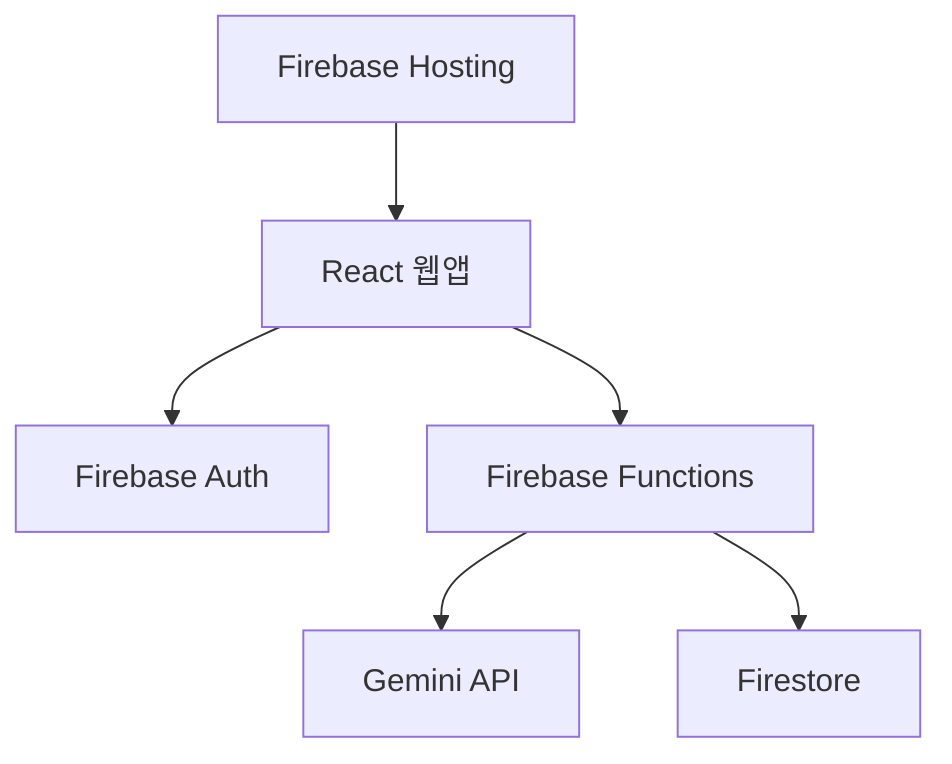
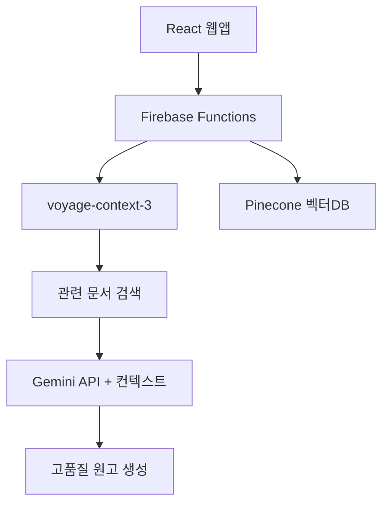

# AI비서관 개발 계획서

## ⚠️ 핵심 개발 요구사항 (CRITICAL REQUIREMENTS)

### 원고 생성 워크플로우
- **1회 시도 = 1개 원고 생성** (절대 한 번에 여러 개 생성 금지)
- **최대 3회 시도 가능**
- **새 원고는 기존 원고들을 좌측으로 밀어내며 추가**
- **총 화면 표시 원고는 최대 3개**

### 설계 취지 (Design Philosophy)
1. **점진적 개선 기회 제공**
   - 사용자가 첫 원고를 보고 세부 조정할 수 있어야 함
   - 3개 동시 생성 시 조정 기회가 사라짐
   - 학습-개선 사이클을 통한 품질 향상

2. **가챠 시스템 심리학 활용**
   - "이번엔 더 좋은 게 나올까?" 하는 기대감 조성
   - 새 원고가 마음에 들거나 이전보다 나아졌을 때 도파민 분비
   - 단순 선택보다 강한 몰입감과 성취감 제공
   - 사용자 주도권과 참여감 극대화

### 금지사항
- ❌ 한 번에 여러 개 원고 생성
- ❌ `generateCount` 같은 파라미터 사용
- ❌ 응답에서 `drafts` 배열로 여러 개 받기
- ❌ API 호출 시 복수 생성 요청

### 올바른 구현 패턴
```javascript
// ✅ 올바른 방식
const generateSinglePost = async (formData) => {
  // 1개만 생성하는 API 호출
  const response = await callGeminiAPI(formData);
  return response.singlePost; // 단일 객체 반환
};

// ✅ 상태 관리
const addNewDraft = (newDraft) => {
  setDrafts(prev => [newDraft, ...prev]); // 앞에 추가
  // 3개 초과 불가능 (최대 3회 시도 제한으로)
};
```

### 잘못된 구현 패턴
```javascript
// ❌ 잘못된 방식
const generatePosts = async (formData) => {
  const response = await callGeminiAPI({
    ...formData,
    generateCount: 3 // 🚫 금지
  });
  return response.drafts; // 🚫 배열 반환 금지
};

// ❌ 잘못된 상태 관리
setDrafts(prev => [...prev, ...normalized]); // 🚫 여러 개 추가 금지
```

---

## 1. 개발 목표

더불어민주당 소속 기초·광역의원 및 예비 정치인을 대상으로 의정활동, 지역 현안, 공약, 주민소통 관련 블로그 원고를 자동 생성하는 웹 애플리케이션을 개발한다. **제미나이 기반 텍스트 생성과 voyage-context-3 RAG 시스템을 단계적으로 도입**하여 사실에 기반한 고품질 정치 콘텐츠 생성 서비스를 구현한다.

## 2. 개발 단계별 기능

### Phase 1: MVP 개발 (0~6개월)
**목표: 핵심 기능 구현 및 검증**

#### 핵심 기능
- **사용자 인증:** Firebase Auth 기반 회원가입/로그인
- **AI 원고 생성:** Gemini API를 활용한 카테고리별 블로그 원고 생성
  - 의정활동 보고
  - 지역 현안 논평  
  - 주민 소통
  - 정책 설명
- **재생성 시스템:** 세션당 3회 재생성 → 확정 워크플로우
- **원고 관리:** 생성 이력 저장, 조회, TXT/PDF 다운로드
- **사용량 추적:** 기본적인 사용 패턴 분석

#### 기술 스택
```javascript
// Frontend
- React 18 + Vite
- Tailwind CSS + shadcn/ui
- Firebase Auth (인증)

// Backend
- Firebase Functions (서버리스)
- Firestore (데이터 저장)
- Gemini API (텍스트 생성)

// 호스팅
- Firebase Hosting
```

### Phase 2: RAG 시스템 도입 (6~12개월)  
**목표: 사실 기반 콘텐츠 생성 시스템 구축**

#### 추가 기능
- **voyage-context-3 RAG:** 정치 특화 문서 검색 시스템
- **정치 문서 DB:** 정책자료, 뉴스, 의정활동 등 임베딩 저장
- **플랜별 차별화:** 검색 깊이 및 컨텍스트 차등 제공
- **결제 시스템:** 토스페이먼츠 연동 구독 관리
- **사용량 제한:** 플랜별 월간 생성 횟수 관리

#### 확장된 기술 스택
```javascript
// 추가된 기술
- voyage-context-3 API (임베딩)
- Pinecone (벡터 데이터베이스)
- 토스페이먼츠 API (결제)

// RAG 파이프라인
사용자 요청 → voyage 검색 → 관련 문서 추출 → Gemini 생성
```

### Phase 3: 고도화 (12~18개월)
**목표: 전면 RAG 적용 및 품질 최적화**

#### 고도화 기능
- **전 플랜 RAG 적용:** 모든 고객 대상 사실 기반 생성
- **실시간 뉴스 연동:** 최신 정치 이슈 자동 업데이트
- **개인화 시스템:** 정치인별 맞춤 문서 가중치
- **팩트체킹:** 생성 내용의 출처 표기 및 검증
- **관리자 도구:** 사용 통계, 사용자 관리 대시보드

## 3. 아키텍처 설계

### Phase 1 아키텍처


### Phase 2 아키텍처 (RAG 도입)


## 4. 상세 개발 일정

### Phase 1: MVP 개발 (4개월)

#### 1개월: 기본 환경 구축
- **Week 1-2:** 프로젝트 초기 설정
  ```bash
  # 프로젝트 구조 생성
  mkdir ai-secretary
  cd ai-secretary
  
  # Firebase 프로젝트 초기화
  firebase init hosting,functions,firestore
  
  # React 프로젝트 생성 (frontend 폴더)
  npm create vite@latest frontend -- --template react
  cd frontend && npm install
  
  # 필수 의존성 설치
  npm install firebase react-router-dom @tanstack/react-query zustand
  npm install -D tailwindcss postcss autoprefixer
  ```
- **Week 3-4:** 인증 시스템 구현
  ```javascript
  // src/services/firebase.js 설정
  // AuthContext 구현
  // 로그인/회원가입 페이지 개발
  ```

#### 2개월: 핵심 기능 개발
- **Week 1-2:** Cloud Functions 백엔드 개발
  ```javascript
  // firebase/functions/src/services/geminiService.js
  const { GoogleGenerativeAI } = require('@google/generative-ai');
  
  exports.generatePost = async (category, content, userProfile) => {
    // Gemini API 호출 로직 - 1개만 생성
  };
  
  // firebase/functions/src/index.js
  const functions = require('firebase-functions');
  exports.generatePost = functions.https.onCall(generatePostHandler);
  ```
- **Week 3-4:** 프론트엔드 생성 UI
  ```javascript
  // frontend/src/components/PostGenerator.jsx
  // frontend/src/hooks/usePostGenerator.js
  // frontend/src/pages/GeneratePage.jsx
  ```

#### 3개월: 데이터 관리 및 재생성 시스템
- **Week 1-2:** Firestore 연동 및 3회 재생성 시스템
  ```javascript
  // 재생성 로직 구현 - 1개씩 추가
  const usePostGenerator = () => {
    const [attempts, setAttempts] = useState(0);
    const [drafts, setDrafts] = useState([]);
    
    const generateSingle = async () => {
      if (attempts < 3) {
        const newDraft = await callAPI(); // 1개만 생성
        setDrafts(prev => [newDraft, ...prev]); // 앞에 추가
        setAttempts(prev => prev + 1);
      }
    };
  };
  
  // Firestore 저장 구조
  {
    userId: string,
    posts: [{
      id: string,
      category: string,
      content: string,
      createdAt: timestamp,
      confirmed: boolean
    }]
  }
  ```
- **Week 3-4:** 히스토리 및 다운로드 기능
  ```javascript
  // frontend/src/pages/HistoryPage.jsx
  // PDF/TXT 다운로드 기능
  ```

#### 4개월: 검증 및 배포
- **Week 1-2:** 검증 파트너 배포
  - 프로덕션 환경 설정
  - 모니터링 도구 연동
  - 피드백 수집 시스템
- **Week 3-4:** 버그 수정 및 최적화
  - 성능 최적화
  - UX 개선
  - 안정성 확보

### Phase 2: RAG 시스템 (6개월)

#### 1-2개월: 데이터 준비
- **정치 문서 수집:** 정책자료, 뉴스, 의정활동 등
- **전처리 파이프라인:** 텍스트 정리, 청킹, 메타데이터
- **voyage-context-3 임베딩:** 문서 벡터화 및 저장

#### 3-4개월: RAG 파이프라인 구축
- **검색 시스템:** voyage API 연동, 유사도 검색
- **컨텍스트 구성:** 검색 결과 + 프롬프트 통합
- **Gemini 연동:** RAG 기반 생성 시스템

#### 5-6개월: 결제 및 플랜 관리
- **토스페이먼츠 연동:** 결제 처리 시스템
- **구독 관리:** 플랜별 사용량 제한
- **플랜별 차별화:** RAG 깊이 조절

### Phase 3: 고도화 (6개월)

#### 1-2개월: 실시간 업데이트
- **뉴스 크롤링:** 정치 뉴스 자동 수집
- **자동 임베딩:** 새 문서 자동 벡터화
- **업데이트 알림:** 사용자 알림 시스템

#### 3-4개월: 개인화 및 팩트체킹
- **개인화 가중치:** 정치인별 문서 우선순위
- **출처 표기:** 생성 내용의 근거 문서 표시
- **신뢰도 점수:** 내용의 신뢰성 지표

#### 5-6개월: 관리 도구
- **관리자 대시보드:** 사용 통계, 사용자 관리
- **성능 모니터링:** 응답 시간, 만족도 추적
- **A/B 테스트:** 기능 개선 실험

## 5. 기술 스택 상세

### 프론트엔드
```javascript
// 핵심 라이브러리
- React 18 (JSX, Hooks, Context)
- Vite (빌드 도구)
- React Router (라우팅)
- React Query (서버 상태 관리)
- Zustand (클라이언트 상태 관리)

// UI 구성
- Tailwind CSS (스타일링)
- shadcn/ui (컴포넌트 라이브러리)
- Lucide React (아이콘)
- React Hook Form (폼 관리)
```

### 백엔드 (Firebase)
```javascript
// Firebase 서비스
- Firebase Auth (인증)
- Firebase Functions (서버리스 API)
- Firestore (NoSQL 데이터베이스)
- Firebase Storage (파일 저장)
- Firebase Hosting (정적 호스팅)

// 외부 API
- Google Gemini API (텍스트 생성)
- voyage-context-3 API (임베딩)
- 토스페이먼츠 API (결제)
```

### 데이터 관리
```javascript
// 벡터 데이터베이스
- Pinecone (관리형 벡터 DB)
- 대안: Weaviate (오픈소스)

// 문서 처리
- 텍스트 전처리 파이프라인
- 청킹 알고리즘 (1000자 단위)
- 메타데이터 관리
```

## 6. 개발 환경 및 도구

### 개발 도구 및 설정 파일
```javascript
// frontend/package.json (주요 의존성)
{
  "dependencies": {
    "react": "^18.2.0",
    "react-dom": "^18.2.0",
    "react-router-dom": "^6.8.0",
    "firebase": "^10.7.0",
    "@tanstack/react-query": "^5.0.0",
    "zustand": "^4.4.0",
    "@radix-ui/react-dialog": "^1.0.0",
    "tailwindcss": "^3.3.0",
    "lucide-react": "^0.263.0"
  },
  "devDependencies": {
    "vite": "^5.0.0",
    "@vitejs/plugin-react": "^4.0.0",
    "eslint": "^8.45.0",
    "prettier": "^3.0.0"
  }
}

// firebase/functions/package.json (백엔드 의존성)
{
  "dependencies": {
    "firebase-functions": "^4.5.0",
    "firebase-admin": "^11.11.0",
    "@google/generative-ai": "^0.1.0",
    "axios": "^1.6.0"
  }
}

// vite.config.js (프론트엔드 빌드 설정)
import { defineConfig } from 'vite'
import react from '@vitejs/plugin-react'

export default defineConfig({
  plugins: [react()],
  build: {
    outDir: '../firebase/public' // Firebase 호스팅 연동
  }
})
```

### 실제 프로젝트 구조 (현재 상태)
```
ai-secretary/
├── 📁 temp_backup/              # 백업 및 임시 파일들
│   ├── 📁 frontend/             # 프론트엔드 백업
│   │   ├── 📁 src/
│   │   │   ├── 📁 components/   # UI 컴포넌트
│   │   │   ├── 📁 constants/    # 상수 정의
│   │   │   │   └── formConstants.js  # 폼 관련 상수
│   │   │   ├── 📁 data/         # 정적 데이터
│   │   │   │   └── 📁 location/ # 지역/선거구 데이터
│   │   │   │       ├── locations.index.js    # 지역 데이터 통합
│   │   │   │       └── locations.*.js        # 각 지역별 데이터
│   │   │   ├── 📁 hooks/        # 커스텀 훅
│   │   │   │   └── usePostGenerator.js       # 원고 생성 훅
│   │   │   └── 📁 pages/        # 페이지 컴포넌트
│   │   │       ├── GeneratePage.jsx          # 원고 생성 페이지 (현재)
│   │   │       └── GeneratePage.legacy.jsx   # 원고 생성 페이지 (레거시)
│   │   └── .gitignore           # 프론트엔드 gitignore
│   ├── 📁 functions/            # Firebase Functions 백업
│   │   ├── 📁 scripts/          # 스크립트
│   │   │   └── bootstrap-admin.js            # 관리자 부트스트랩
│   │   ├── 📁 services/         # 서비스 로직
│   │   │   └── district.js      # 선거구 관리 서비스
│   │   └── package-lock.json    # 의존성 잠금
│   ├── .gitignore               # 프로젝트 gitignore
│   └── 개발계획서/사업계획서.md  # 각종 기획 문서들
│
├── 📄 # AI비서관 개발 계획서.md  # 메인 개발 계획서 (이 문서)
└── 📄 .firebaserc              # Firebase 프로젝트 설정
```

### 표준 구조로 정리 예정
```
ai-secretary/
├── 📁 functions/               # Firebase Functions (서버리스 백엔드)
│   ├── 📁 src/
│   │   ├── index.js           # Functions 진입점
│   │   ├── 📁 services/       # 핵심 비즈니스 로직
│   │   │   ├── geminiService.js       # Gemini API 연동
│   │   │   ├── district.js            # 선거구 관리
│   │   │   └── userService.js         # 사용자 관리
│   │   └── 📁 utils/          # 유틸리티
│   ├── 📁 scripts/            # 관리 스크립트
│   └── package.json
│
├── 📁 frontend/               # React 프론트엔드
│   ├── 📁 public/
│   ├── 📁 src/
│   │   ├── 📁 components/     # 재사용 컴포넌트
│   │   ├── 📁 constants/      # 상수 (formConstants.js 등)
│   │   ├── 📁 data/          # 정적 데이터 (지역 정보 등)
│   │   ├── 📁 hooks/         # 커스텀 훅 (usePostGenerator 등)
│   │   ├── 📁 pages/         # 페이지 컴포넌트
│   │   └── 📁 services/      # API 클라이언트
│   ├── package.json
│   └── vite.config.js
│
├── 📄 firebase.json           # Firebase 프로젝트 설정
├── 📄 firestore.rules        # Firestore 보안 규칙
└── 📄 .firebaserc            # Firebase 연결 설정
```

## 7. 품질 관리 및 테스트

### 테스트 전략
```javascript
// 테스트 유형
- 유닛 테스트: Jest + React Testing Library
- 통합 테스트: Firebase Emulator
- E2E 테스트: Playwright (핵심 플로우만)

// 코드 품질
- ESLint + Prettier (코드 스타일)
- TypeScript (타입 안전성)
- Husky (Git hooks)
```

### 모니터링
```javascript
// 성능 모니터링
- Firebase Performance Monitoring
- Web Vitals 추적
- 에러 로깅: Sentry

// 사용자 분석
- Firebase Analytics
- 사용 패턴 추적
- 만족도 조사
```

## 8. 배포 및 운영

### 배포 전략
```javascript
// 환경 분리
- 개발: Firebase Emulator
- 스테이징: Firebase 테스트 프로젝트  
- 프로덕션: Firebase 메인 프로젝트

// CI/CD
- GitHub Actions
- 자동 테스트 + 배포
- 롤백 전략
```

### 보안 고려사항
```javascript
// Firebase 보안 규칙
- Firestore 보안 규칙
- Storage 보안 규칙
- Functions 권한 관리

// API 보안
- API 키 관리
- 요청 제한 (Rate Limiting)
- 사용자 권한 검증
```

## 9. 성능 최적화

### 프론트엔드 최적화
```javascript
// 번들 최적화
- 코드 스플리팅
- 레이지 로딩
- 트리 셰이킹

// 런타임 최적화
- React.memo 활용
- useMemo, useCallback
- 가상화 (긴 목록)
```

### 백엔드 최적화
```javascript
// Firebase 최적화
- Firestore 인덱싱
- 배치 작업 활용
- 캐싱 전략

// API 최적화
- 응답 압축
- 병렬 처리
- 에러 재시도 로직
```

## 10. 개발 리스크 및 대응

### 기술적 리스크
- **Gemini API 제한:** 사용량 모니터링 + 유료 전환 준비
- **Firebase 확장성:** 트래픽 모니터링 + 최적화
- **voyage-context-3 의존성:** 대체 임베딩 모델 검토

### 개발 리스크
- **일정 지연:** 단계별 검증으로 리스크 최소화
- **기술 학습 곡선:** 단계적 기술 도입
- **품질 관리:** 지속적 테스트 + 코드 리뷰

이 개발 계획서를 통해 **체계적이고 안정적인 AI비서관 서비스 개발**을 단계적으로 진행할 수 있습니다.